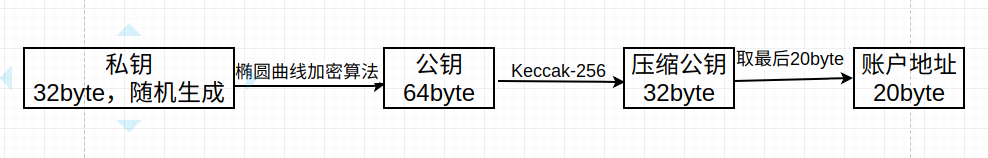

# 用go做以太坊开发

[Go Ethereum 书籍中文版](https://goethereumbook.org/zh/)

[HD钱包](https://github.com/miguelmota/go-ethereum-hdwallet)

## 以太坊账户

- [账户余额](./account_balance/main.go)
- [生成新钱包](./wallet_generate/main.go)
- [密钥库](./keystore/main.go)
- [分层确定性钱包](./hdwallet/)
  - [使用助记词生成账户](./hdwallet/derive/main.go)
  - [使用助记词生成公私钥对](./hdwallet/keys/main.go)
  - [使用随机数生成账户](./hdwallet/seed/main.go)
  - [交易签名](./hdwallet/sign/main.go)
- [地址验证](./address_check/main.go)
- [使用r-s-v-签名推倒公钥](./r_s_v_recover/main.go)

## 交易

- [查询区块](./blocks/main.go)
- [查询交易](./transactions/main.go)
- [监听新区块](./block_subscribe/main.go)
- [topic哈希计算](./calc_topic/main.go)

## 智能合约

- [创建智能合约](./contracts/store/store.sol)
- [部署智能合约](./contract_deploy/main.go)
- [加载智能合约](./contract_load/main.go)
- [查询智能合约](./contract_read/main.go)
- [写入智能合约](./contract_write/main.go)
- [读取智能合约二进制](./contract_bytecode/main.go)
- [查询ERC20代币智能合约](./contract_read_erc20/main.go)

## 事件日志

- [监听事件日志](./event/event_subscribe/main.go)
- [读取事件日志](./event/event_read/main.go)
- [读取ERC20事件日志](./event/event_read_erc20/main.go)

## 转账

- [ETH转账](./transfer_eth/main.go)
- [代币转账](./transfer_token/main.go)

## 签名

- [生成签名](./signature/generate/main.go)
- [验证签名](./signature/verify/main.go)

## 生成AK-SK

- [生成AK-SK](./generate_ak_sk/main.go)

### 助记词推导到地址的步骤

``` text

1、借助以太坊源码包，通过BIP44定义的目录获取对应的钱包目录path。
2、借助bip39包，通过记助词生成种子seed
3、使用btcutil，将seed变成masterKey
4、借助btcutil，利用masterKey+path生成私钥privateKey。
5、使用ecdsa，通过私钥生成公钥。
6、利用以太坊源码将publicKey转换为地址。

链接：https://juejin.cn/post/7114309381134483487

```

## 公钥&私钥&地址关系

- [私钥、公钥和地址](./pub_key_addr/main.go)

1. 使用椭圆曲线算法ECDSA-secp256k1将私钥映射生成公钥,一个私钥只能映射出一个公钥。
2. 使用hash算法Keccak-256对公钥进行hash，将公钥转化为32 byte，然后去最后的20 byte作为账户地址。
3. 地址没办法直接推导出公钥，使用摘要和签名可以推导出公钥

### 生成过程



#### 以太坊中的私钥

它由一个密码和一个keyfile组成,这个密码就是你使用 ks.NewAccount("xxx")创建新账户时输入的那串“xxxx”字符串。而keyfile是你在创建账户后自动生成的json格式的文件，他一般保存在~/keystore/目录下


> keyfile 示例

```json
{
    "address": "55acb7320fce7d4b9d60da183a5415fe617b7799",
    "crypto": {
        "cipher": "aes-128-ctr",
        "ciphertext": "ea86238cc530fc82697cddf806420b46e367506c2612e77705cd49fc68e8abab",
        "cipherparams": {
            "iv": "a952274c8c23c776142858b7d4eb47ce"
        },
        "kdf": "scrypt",
        "kdfparams": {
            "dklen": 32,
            "n": 262144,
            "p": 1,
            "r": 8,
            "salt": "e500a379d2fc5aa08f6b3efd1d47c62ef005eb4193d487a7cf0314e872965782"
        },
        "mac": "a883b940d426e18d301225afe56088fecf668d27da5b39d5c802d1099a421ab1"
    },
    "id": "73d77f7d-40db-40ed-b3fe-92a3aec099c1",
    "version": 3
}

```

**项目根目录下创建 .env 文件**

``` txt
PRIVATE_KEY=your_private_key
INFURA_PROJECT_ID=your_infura_project_id
```